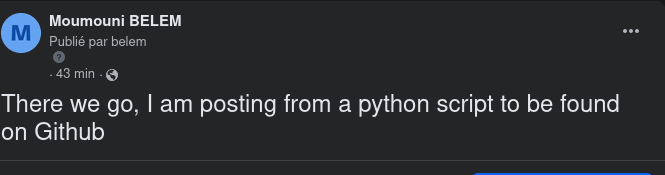
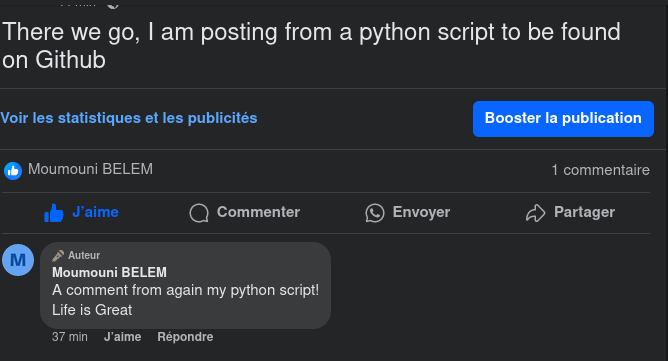
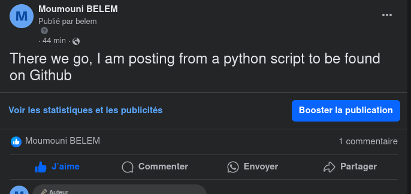

## facebook_page_monitor
 Monitor your facebook page with a python script

### Installation
Install depensdencies from rquirements.txt

```bash
pip install -r requirements.txt
```

## Running
In ```facebook_page_monitor``` directory, run

```bash
python3 facebook_page_monitor.py
```

## Examples of use
### 1. Writing a post

[](data/post.png)

### 2. Commenting a post

[](data/comment.png)


### 3. Liking a post

[](data/like.png)

### 4. Uplaoding a photo

[](data/photo.png)

## Disclaimer

To access your Facebook page using the Python script, you need to have a Facebook developer account to access the Graph API.
[Here](https://developers.facebook.com/) is where to find suitable info.
